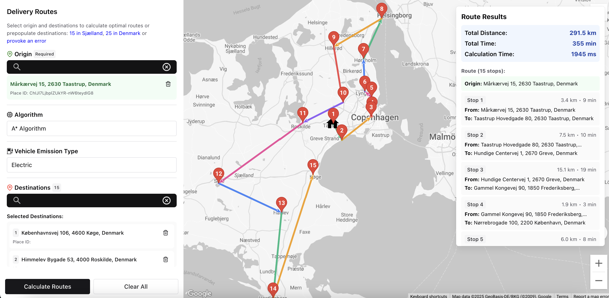

# Mover Systems Challenge

## Summary

This is a fullstack delivery route optimization application built as part of the Mover Systems engineering challenge. The system allows users to input multiple delivery addresses and calculates the optimal route using various algorithms including the Nearest Neighbor Algorithm.



The application consists of:

- **Backend API** (.NET 9.0): Integrates with Google Routes Directions API to calculate routes and implements route optimization algorithms
- **Frontend UI** (React/TypeScript): Provides a user-friendly interface for inputting delivery addresses and visualizing optimized routes on Google Maps

**Key Features:**

- Route optimization using multiple algorithms (Nearest Neighbor, etc.)
- Interactive Google Maps integration for route visualization
- Real-time route calculation with distance and time estimates
- Support for origin and multiple destinations
- Responsive web interface built with Chakra UI

## Prerequisites

Before running this application, ensure you have the following installed:

- **.NET 9.0 SDK** - [Download here](https://dotnet.microsoft.com/download/dotnet/9.0)
- **Node.js** (v22 or higher) - [Download here](https://nodejs.org/)
- **npm** (comes with Node.js)
- **Google Maps API Key** with the following APIs enabled:
  - Google Maps JavaScript API
  - Google Routes API
  - Places API (for address autocomplete)

## Installation

1. **Clone the repository:**

   ```bash
   git clone <repository-url>
   cd mover_systems_challenge
   ```

2. **Install API dependencies:**

   ```bash
   cd api
   dotnet restore
   ```

3. **Install UI dependencies:**

   ```bash
   cd ../ui
   npm install
   ```

4. **Configure Google Maps API Key:**
   - Create `api/appsettings.json` file based on `appsettings.json.example` with your Google Maps API key or use one provided
   - Create `ui/.env` file based on `ui/.env.example` and add your Google Maps API key or use one provided

## Running the API and UI

### Start the Backend API

1. Navigate to the API directory:

   ```bash
   cd api
   ```

2. Run the API:
   ```bash
   dotnet run
   ```

The API will start on `http://localhost:5046` with Swagger documentation available at `/swagger`.

### Start the Frontend UI

1. In a new terminal, navigate to the UI directory:

   ```bash
   cd ui
   ```

2. Start the development server:
   ```bash
   npm run dev
   ```

The UI will start on `http://localhost:5173` (or another available port if 5173 is in use, refer to stdout for full URL).

### Access the Application

Once both services are running:

- Open your browser and go to `http://localhost:5173`
- The frontend will automatically connect to the backend API
- You can also access the API documentation at `http://localhost:5046/swagger`

**Note:** Make sure both the API and UI are running simultaneously for the application to work properly.
